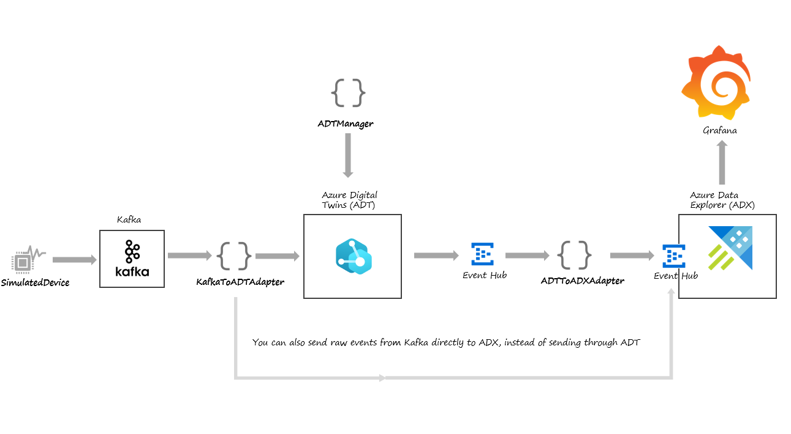

# Kafka - Azure Digital Twins E2E Integration Sample
- **ADTManager**: uploads DTDL models and creates initial Twin instances.  
- **SimulatedDevice**: simulates devices which send KPI metrics and status to Kafka.  
- **KafkaToADTAdapter**: reads KPI metrics and status from Kafka, maps those to DTDL models and updates Twins.  
- **ADTToADXAdapter**: reads Twin Change Events (published by ADT) from Event Hub, converts Json Patches to simple Json and forwards this data to another Event Hub (ADX data source).

## Architecture

